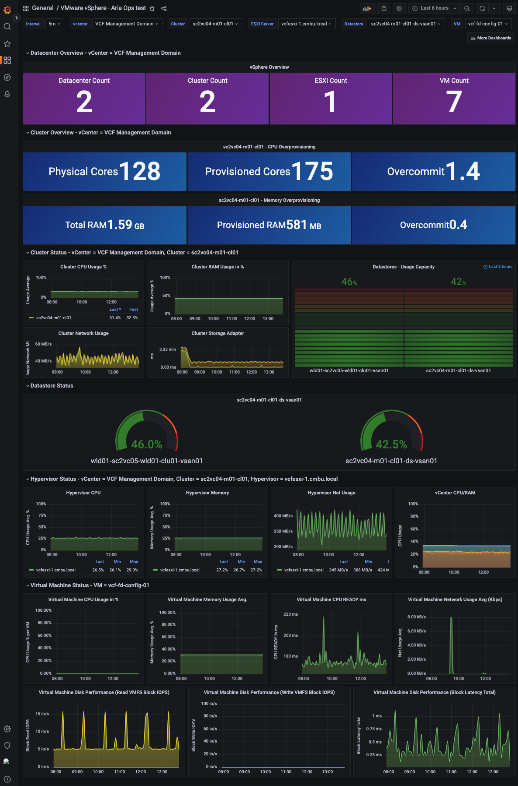

# Aria Operations dashboards for Grafana

## Abstract
This is clone of Jorge de la Cruz' vSphere dashboard, but with an Aria Operations datasource instead of InfluxDB.

## Prerequisites
* Grafana 9.x or later.
* Dashboard version 1.0.0: Aria operations plugin 1.2.0 or later.
* Dashboard version 1.1.0: Aria operations plugin 1.2.1 or later.

## Installation
Simply import the `aria-ops-dashboard-<version>.json` file from the Grafana dashboard creation file.

## Acknowledgements
This dashboard is heavily influenced by this project: https://github.com/jorgedlcruz/vmware-grafana by Jorge de la Cruz.
Thank you Jorge for making th is available!

### Example screenshot

